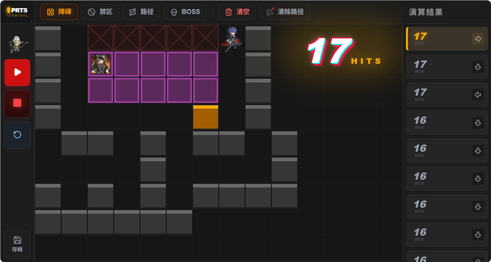
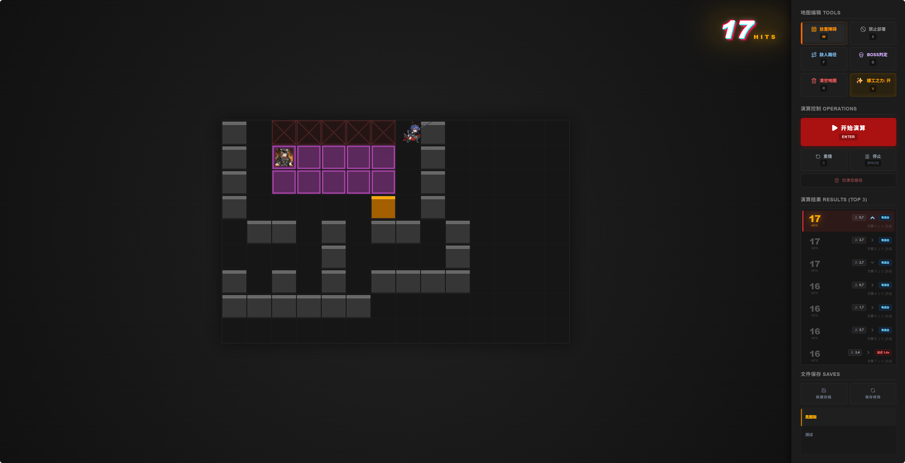

# 🐉 CHEN SIMULATOR (陈模拟器)

[](https://nextjs.org/)
[](https://react.dev/)
[](https://tailwindcss.com/)
[](https://github.com/pmndrs/zustand)

这是一个基于《明日方舟》干员**赤刃明霄陈**与**娜斯提**技能特性开发的深度战术仿真模拟器。采用 PRTS 战术终端视觉风格，旨在通过高精度的碰撞算法演算，帮助玩家探索极限的输出方案。

## 🌟 核心特性

- **📱 响应式全平台适配**
  - **沉浸式体验**：针对桌面端提供侧边栏详细监控，移动端（横屏）优化布局，通过 VH/VW 响应式设计确保各种屏幕比例下的极致操作手感。
- **👹 巨型 BOSS 仿真**
  - **多格碰撞支持**：支持放置固定位置的巨型 BOSS 目标，完美模拟大型敌人的碰撞体积，计算出剑气绕行与命中的最佳路径。
- **🛠️ 娜斯提动态高台**
  - **极限凹分神器**：支持“娜工之力”高级配置，允许玩家模拟**娜斯提的高台在剑气经过瞬间生成**的极限操作。通过毫秒级延迟计算，改变剑气后续反弹路径，榨干每一帧的伤害潜力。
- **📊 智能评分系统**
  - **多方案纵览**：系统会自动演算数百种起始落点与反弹角度，实时渲染最佳方案。
  - **Top 3 榜单**：自动展示评分前三（含得分并列）的最优解，支持多方案快速切换对比，一键查看不同战术的演算路径。
- **⚙️ PRTS 数据级碰撞算法**
  - **解包还原**：严格遵循 PRTS 解包底层的数值设定，包括碰撞半径、转弯延迟、匀速衰减模型等，算法逻辑与游戏实际表现高度一致。

## 🔬 演算模块预览

- **实时重播**：支持对某一特定方案进行无限次慢动作重播，精准定位有效打击点。
- **色散重影**：战术终端风格的视觉反馈，每一次 HIT 都会触发动态脉冲特效。
- **存档管理**：内置文件管理器，支持保存/加载多套复杂的障碍物布设与路径方案。

## 🛠️ 技术栈

- **Core**: Next.js 15+ (App Router), React 19
- **State**: Zustand
- **Styling**: Tailwind CSS 4.0
- **Animation**: Framer Motion & High-performance CSS Keyframes
- **Icons**: Lucide React
- **Engine**: Pure JavaScript Matrix-based Collision Engine

## 🚀 快速开始

### 1. 克隆项目

```bash
git clone https://github.com/your-repo/chen-simulator.git
cd chen-simulator
```

### 2. 安装依赖

```bash
npm install
```

### 3. 开启终端

```bash
npm run dev
```

访问 [localhost:3000](http://localhost:3000) 进入战术模拟界面。

## 📸 视觉预览

移动端UI


桌面端UI


**声明**: 本项目为《明日方舟》粉丝创作，相关角色形象、技能设计、美术资源及“PRTS”等相关商标版权均属于 [上海鹰角网络 (Hypergryph)](https://www.hypergryph.com/) 所有。本工具仅用于游戏机制研究与战术交流。
